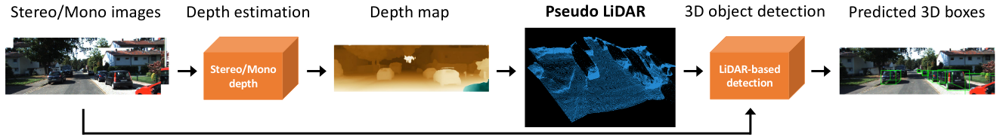
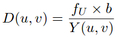
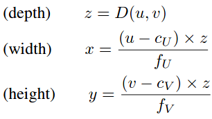

## Pseudo-LiDAR 
### [<kbd>CVPR 2019</kbd> Pseudo-LiDAR from Visual Depth Estimation:Bridging the Gap in 3D Object Detection for Autonomous Driving](https://openaccess.thecvf.com/content_CVPR_2019/papers/Wang_Pseudo-LiDAR_From_Visual_Depth_Estimation_Bridging_the_Gap_in_3D_CVPR_2019_paper.pdf)

| Category | Description |
| :--: | -- |
| Type | ● Monocular OD / supervised   ● Stereo OD / supervised| 
| Contribution | Bridging the gap between camera based approach and lidar based approach by **a simple conversion from 2D depth map into pseudo 3D point cloud** |
| Key ideas | 1. Depth estimator (SOTA) ➔ depth map ➔ 2. **Convert into pseudo 3D point cloud** ➔ 3. LiDAR-based object detector (SOTA) ➔ 3D object bbox | 
| Pipeline | ● Train mono depth estimator [DORN](../depth_estimation/dorn.md) on 23488 [KITTI](../dataset/kitti.md) images (raw data) (some of these images may **overlap** with our validation data for detection)  ●  Train bino depth estimator [PSMNet](../depth_estimation/psmnet.md) on [Scene Flow](../dataset/sceneflow.md) and then fine-tuning on the 200 training pairs of [KITTI](../dataset/kitti.md) stereo 2015 (200 training images of KITTI stereo 2015 **overlap** with thevalidation images of KITTI object detection)  ● Train Frustum PointNet (F-POINTNET) & AVOD on generated pseudo point cloud|
| Network | [DORN](../depth_estimation/dorn.md), [PSMNet](../depth_estimation/psmnet.md) ➔ F-PointNet, AVOD |
| Loss | [DORN](../depth_estimation/dorn.md), [PSMNet](../depth_estimation/psmnet.md) ➔ F-PointNet, AVOD |
| Params + Time |  | 
| Tech | ● D(u, v): depth map at picel (u, v);  fU: horizontal focal length of the left camera;  b: horizontal offset (i.e., baseline) of stereo camera;  Y(u, v): the horizontal disparity from left image to right image for each pixel      ● (x, y, z): 3D location of each pixel (u, v)  (cU, cV) is the pixel location corresponding to the camera center and fV is the vertical focal length    | 
| Limitations | ● Pseudo point cloud depends strongly on the accuracy of depth estimator [depth limitation](../depth_estimation/depth_limit.md)   ● Training process is cumbersome   ● Not an end-to-end training fashion |
| TOTEST |  |

