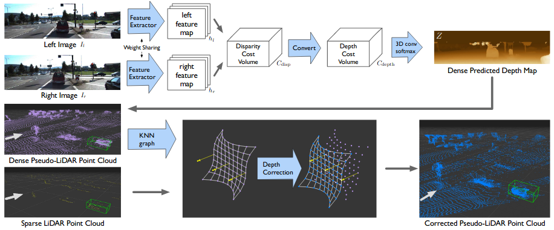
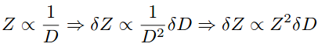
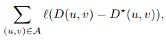
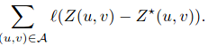
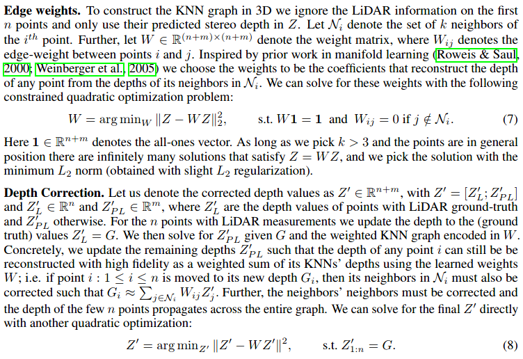
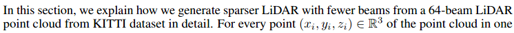
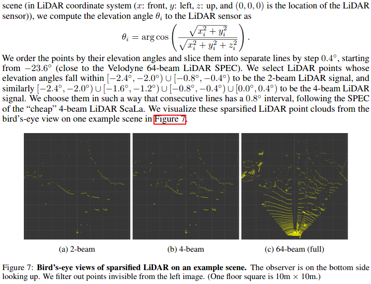

<!-- CSS -->
<link rel="stylesheet" style="text/css" href="../styles.css">
<!--     -->

## Pseudo-LiDAR++ 
### [<kbd>ICLR 2020</kbd> Pseudo-LiDAR++: Accurate Depth for 3D Object Detection in Autonomous Driving](https://arxiv.org/pdf/1906.06310.pdf)

| Category | Description |
| -- | -- |
| Type | stereo / stereo+Lidar 4 beams 3D object detection / supervised | 
| Contribution | ● Depth Cost Volume   ● Depth correction to de-bias the depth estimation   ● pseudo-pipeline   ● Simulation LiDAR 4 beams from LiDAR 64 beams|
| Key ideas | 1. Depth estimator (SOTA) ➔ depth map 2. Depth correction ➔ 3. **Convert into pseudo 3D point cloud** ➔ 4. LiDAR-based object detector (SOTA) ➔ 3D object bbox | 
| Pipeline | ● Pre-train their stereo depth estimator SDN on the synthetic [Scene Flow dataset](../dataset/sceneflow.md) and fine-tune it on the 3712 training images of [KITTI OD](../dataset/kitti.md).  ● Using LiDAR 4 beams input to correct the predicted depth map (KNN (K=10)) ● Train AVOD, PIXOR & PointRCNN on generated pseudo point cloud on 3,712 training [KITTI OD](../dataset/kitti.md)|
| Network | **Depth estimation:** Stereo Depth Network (SDN) use [PSMNet](../depth_estimation/psmnet.md) as the backbone and then adding depth cost volume (to directly minimize depth loss instead of disparity mloss; For example, it may be completely appropriate to locally smooth two neighboring pixels with disparity 85 and 86 (changing the depth by a few cm to smooth out a surface), whereas applying the samekernel for two pixels with disparity 5 and 6 could easily move the 3D points by 10m or more;  a single pixel error in disparity implies only a 0.1merror in depth at a depth of 5 meters, but a 5.8m error at a depth of50 meters)    and then adding 3D conv softmax  ● disparity in the range of [0,191] (following PSMNet) (discontinuous disparity ~ disp pixel))  ● depth in the range of [1m,80m] and set the grid of depth in Cdepth to be 1m (discontinuous depth ~ 1/(disp pixel)) |
| Loss | ● in [PSMNet](../depth_estimation.md) the smooth L1 loss on the predicted disparity    ● in Pseudo-LiDAR++ the smooth L1 loss on the predict depth   |
| Params + Time |  | 
| Tech | ● Depth correction --> KNN   ● Simulation LiDAR 4 beams     |
| Limitations |  |
| TOTEST |  |

 