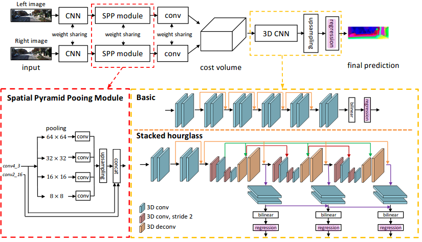
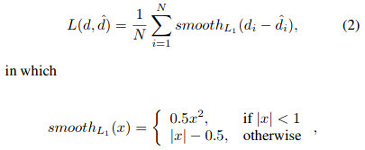
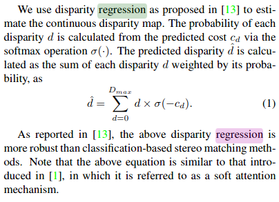

<!-- CSS -->
<link rel="stylesheet" style="text/css" href="../styles.css">
<!--     -->

## PSMNet
### [<kbd>CVPR 18</kbd> Pyramid Stereo Matching Network](https://arxiv.org/pdf/1803.08669.pdf)

| Category | Description |
| :--: | -- |
| Type | | 
| Contribution | ● end-to-end  learning  framework  forstereo matching without any post-processing  ● pyramid pooling module for incorpo-rating global context information into image features  a stacked hourglass 3D CNN to extend theregional support of context information in cost volume.|
| Key ideas |  | 
| Pipeline |  |
| Network |  Spatial Pyramid Pooling (SSP) module to gather context information then oncatenate the left and right feature maps into a cost volume (concatenating left feature maps with their cor-responding right feature maps across each disparity level,resulting in a 4D volume (height×width×disparity×featuresize).) , which is fed into a 3D CNN for regularization, finally, regression is applied to calculatethe output disparity map |
| Loss | **Smooth L1 loss** is widely used in bounding box regression for object detection  because  of  **its  robustness  and  low  sensitivity  to outliers [7], as compared to L2 loss** (on the predicted disparity)   |
| Params + Time |  | 
| Tech |  |
| Limitations |  |
| TOTEST |  |
