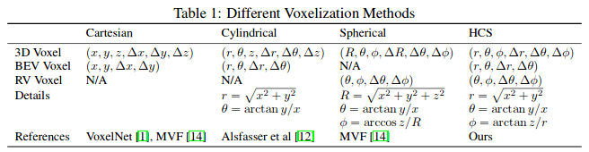

<!-- CSS -->
<link rel="stylesheet" style="text/css" href="../styles.css">
<!--     -->

## Network design

| Net prob | Ref | Des | Formula |
| -- | -- | -- | -- |
| Resolution (multi-scale) | Depth Map Prediction from a Single Imageusing a Multi-Scale Deep Network  FPN feature pyramid network  Fine-Grained Dynamic Head for Object Detection | |
| attack adversarial | [ Certified Object Detection](https://proceedings.neurips.cc/paper/2020/file/0dd1bc593a91620daecf7723d2235624-Paper.pdf) | | |
| Dense object detection | | | |

## LiDAR in neural net
| category | des |
| -- | -- |
| bird eye view (BEV) | PIXOR [4], based on 2D CNNs project point clouds into BEV. However, projection suffers from3D structural information loss   To mitigate information loss, recent voxel-based detectors, such asVoxelNet [1], SECOND [2], PartA2[7] and Fast Point R-CNN [8], preserve the 3D structure duringvoxelization and adopt 3D CNNs at early or intermediate stages and finally project features to BEVand detect objects from BEV.|
| range view (RV) | There are very few works (LaserNet [5]) that learn representations fromRV. RV is a compact representation that aligns with LiDAR scan pattern. But current RV detectorsrequires more data to perform well [5] and are outperformed BEV detectors on public datasets [15]. **Occlusion and different scales of objects** in RV also pose challenges to detection. |
| Voxelization for pcl | To transform point clouds into image-like grid structures so that convolutional neural networks can beapplied, several works group point clouds into volumetric grids. Commonly used volumetric grids arecuboid-shaped ones under Cartesian coordinate system. VoxNet [10] represents the cuboid-shapedvoxels as occupancy grids: if there are no points in that voxel, the grid value is0, or1otherwise. Toavoid quantization effects of occupancy grids and extract richer voxel features, VoxelNet [1] samplesa fix number of points within each voxel and applies Voxel Feature Extractor (VFE, a small PointNet[11] made of fully connected layers and a max pooling layer) to points in each voxel to extract voxelfeatures. For efficiency, PointPillars [3] discretizes the 3D space into pillars so there is only one voxelalong the height dimension.Some recent works start to explore voxel shapes other than cuboids. Alsfasser et al [12] voxelizespoints under the Cylindrical Coordinate System. PolarNet [13] groups points into 2D polar grids onBEV for semantic segmentation. MVF [14] adopts both cuboid-shape voxels and spherical voxels.    |

### General notes
- Need to leverage these encoders like ResNet, DenseNet, etc which are pre-trained on ImageNet dataset
- decoder part uses Bilinear Upsampling (brief: a ‘smoother’ image overall after upsampling) rather than simple Upsampling