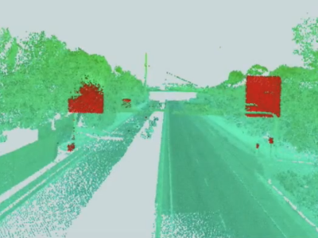

<!-- CSS -->
<link rel="stylesheet" style="text/css" href="styles.css">
<!--     -->

## All about self-driving cars
- [Tools](#tools)
- [Sensors](#sensors)
- [Level of autonomous driving](#level-of-autonomous-driving)
- [research question](#research-question)

> **_Ref:_** [Everything You Need to Know About Self-Driving Cars](https://www.fool.com/investing/2017/06/03/everything-you-need-to-know-about-self-driving-car.aspx)

### Tools
- Meshlab: 
- VTK: Process images and create 3D computer graphics with the Visualization Toolkit.
- LiDARView
- Open3D

### Sensors

> **_shortcuts:_** Strengths: Str; Weaknesses: Weak

Ref: [LiDAR vs. Cameras for Self Driving Cars – What’s Best?](https://www.autopilotreview.com/lidar-vs-cameras-self-driving-cars/)

| Sensor | Camera | LiDAR | RADAR |
| -- | -- | -- | -- |
| Difi | | Use of light wavelengths   Range: HDL64 S3D and VLP32C scanners achieve a range of 100 m and 120 m | Use radio waves   Rang: up to 200 m | 
| Aim to | | Identify objects and measure distances | Identify objects and determine velocity and angles |
| Str | ● Rich texture information (color, contrast, etc)   ● Cheap   ● High resolution   ● Long range | ● Good for detecting speed and distance up to 200 meters in light or dark   ● Invariant to ambient light | ● Measures radial distance AND velocity   ● Good range (near & long)   ● More robust than LIDAR in snow, fog & rain   ● Better at detecting objects at close range |
| Weak | ● Only work in good light conditions   ● Sensitive to lighting conditions   ● Len artifacts (distortion, vignette, flare, etc)  ● No explicit depth information | ● Not good at detecting very close objects   ● Not work very well in fog, rain, or dust (due to its use of light wavelengths) (they generate puffy point clouds that may render the output of LiDAR point cloud inaccurate)   ● Doesn't distinguish color & contrast   ● Very expensive (75000$ for LiDAR 64 beams)   ● Limited resolution | ● Weak returns from small objects   ● Lower resolution than LiDAR   ● Multipath propagation |
| Awere | | ● Cheaper in the future?   ● Down to low resolution (32, 16, 4 beams) for cheaper | |

Others: 
- LiDAR - Solid State, Ultrasonic, Cameras - Infrared, Microphones
- **Ultrasonic** systems emit ultrasonic sound waves and determine distance by how long these waves take to return to the source (this is how bats echolocate). Ultrasonic sensors are good for close-range detection in all weather, but do not have the range of LIDAR or radar.
- Simulation: downsampling process the scan lines of the LiDAR depth(64-line to 32-line...) --> TODO

##### [LiDAR Intensity](https://geodetics.com/lidar-intensity-applications/):
LiDAR intensity is recorded as the return **strength of a laser beam**. In the Geo-MMS LiDAR systems, it is a bi-product, provided as an integer number between *1-256*. This number varies with the **composition of the surface object reflecting the laser beam**. A low number indicates low reflectivity while a high number indicates high reflectivity. The intensity of the laser beam return can also **be affected by the angle of arrival (scan angle), range, surface composition, roughness, and moisture content**.  This means that features under the nadir of the LiDAR sensor usually have higher intensity than the same features along the edges (tilted further), as the returned energy decreases. For these reasons, LiDAR intensity does not always lead to consistent results. It must be used as a relative measurement.  An advantage is that unlike passive vision sensors (cameras), it is indifferent to shadows.

##### Filter LiDAR data point-by-point 
Ref: https://www.safe.com/blog/2013/10/14-ways-to-take-charge-of-lidar-data/  
use calculations to filter your point cloud. For example, we know that road signs are very reflective. (Unless you live in the woods or in one of those cities that doesn’t have any streets – in which case, this is me informing you that road signs are very reflective.) This reflectiveness would be represented in the intensity component of a LiDAR dataset. So if we create a filtering expression around the intensity component, we can extract the road signs.  
  
You can see the road signs highlighted in red, having been extracted from the original point cloud behind it.

### Level of autonomous driving

| Autonomous | Description |
| -- | -- |
| Level 0 | No self-driving feature |
| Level 1 | Controls one system at a time, like cruise control, or automatic emergency braking |
| Level 2 | Can control two functions simultaneously, such as speed and steering. Tesla's Autopilot is level 2, and other car manufacturers such as BMW are offering level 2 features, as long as there is a driver paying attention |
| Level 3 | This level includes basically fully autonomous features, but will warn a driver when the driver needs to take control. This is incredibly complicated to do, because once humans get used to the self-driving function, we tend to doze off or get distracted. This level won't deliver an appreciable jump in safety over level 2, so many companies are skipping this step |
| Level 4 | Nearly autonomous. It may be possible for a human to control the car, but the car will drive itself completely and shut itself off if things go wrong. |
| Level 5 | Completely autonomous; these cars lack pedals or a steering wheel and are not meant to be driven by humans. |

**Semi-autonomous** features are essentially in levels 1 through 3, and, like Tesla's Autopilot feature, are already in some luxury cars now.

**Fully autonomous** cars, at levels 4 and 5, do not require a driver to be present at all. This type of vehicle is very far off, and some question its viability, but wide adoption of fully autonomous vehicles would be the true revolution some are anticipating.

### Research question

Ref: [Deep Multi-modal Object Detection and Semantic Segmentation for Autonomous Driving: Datasets, Methods, and Challenges](https://arxiv.org/pdf/1902.07830.pdf)

