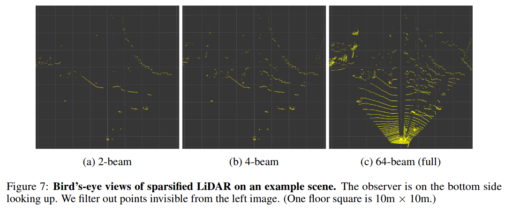
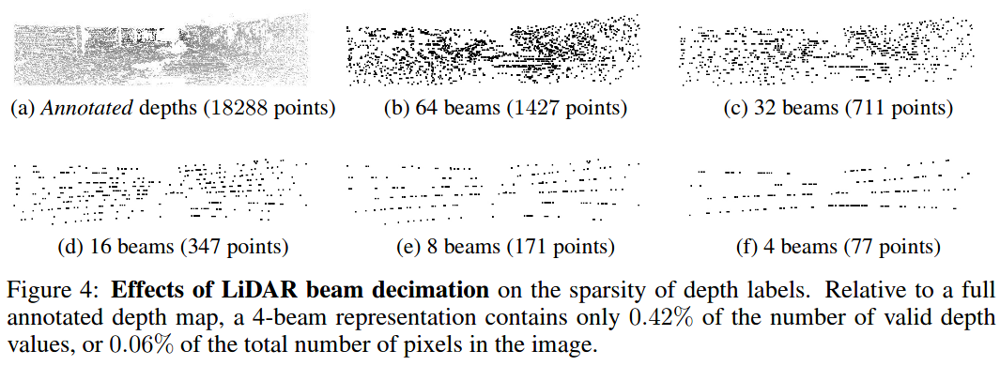

## LiDAR preprocessing

[<kbd>Sensors 20</kbd> Large-Scale Place Recognition Based onCamera-LiDAR Fused Descriptor](https://www.mdpi.com/1424-8220/20/10/2870/pdf)

- the **quantity of points** in each point cloud is not the same, so we need to **resample** the points in a fixed number
- the **ground points** are **redundant** to form a discriminative descriptor utilizing the structure information of eachframe, reduce the **consumption** of the memory --> how to remove [Fast Segmentation of 3D Point Clouds for Ground Vehicles](https://sci-hub.do/10.1109/ivs.2010.5548059)
    - use downsample API in the PCL Library
    - the leaf size which represents the size of grid cells in the point cloud is set to(0.3, 0.3, 0.1)
    - randomly pickN=6000points as our input of LiDAR to give a slight disturbance to the pcl

## Downsample LiDAR 64 beams

[<kbd>ICRL 20</kbd> Pseudo-LiDAR ++](https://arxiv.org/pdf/1906.06310.pdf) (Downsample to LiDAR 4 beams) [[Notes](pseudo_lidar++.md)]

[<kbd>CRL 20</kbd> Robust Semi-Supervised Monocular Depth Estimation with Reprojected Distances](http://proceedings.mlr.press/v100/guizilini20a/guizilini20a.pdf)

