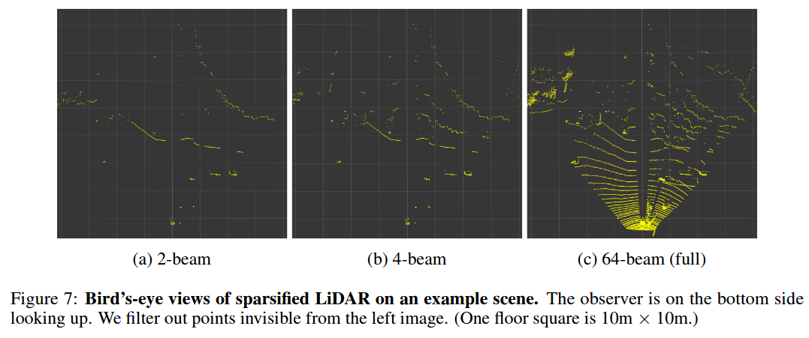
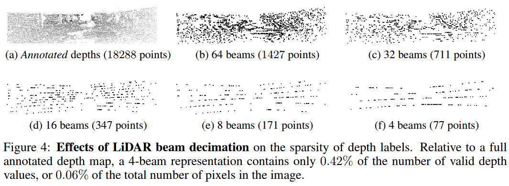

[<kbd>ICRL 20</kbd> Pseudo-LiDAR ++](https://arxiv.org/pdf/1906.06310.pdf) (Downsample to LiDAR 4 beams) [[Notes](pseudo_lidar++.md)]

[<kbd>CRL 20</kbd> Robust Semi-Supervised Monocular Depth Estimation with Reprojected Distances](http://proceedings.mlr.press/v100/guizilini20a/guizilini20a.pdf)

