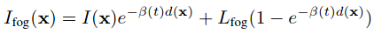

<!-- CSS -->
<link rel="stylesheet" style="text/css" href="../styles.css">
<!--     -->

## Rendering rain

## Rendering Fog

Ref:

Rendering fog was done in [<kbd>ICVSS 19</kbd> Semantic Understanding of Foggy Scenes
with Purely Synthetic Data](https://www.trace.ethz.ch/publications/2019/foggy_synscapes/)

Rendering fog from [Physics-Based Rendering for Improving Robustness to Rain](https://team.inria.fr/rits/files/2020/11/2019-iccv-weatheraugment.pdf)

Additional Simulation Results [Seeing Through Fog Without Seeing Fog:Deep Multimodal Sensor Fusion in Unseen Adverse Weather (Supplemental Material)](https://www.cs.princeton.edu/~fheide/AdverseWeatherFusion/figures/AdverseWeatherFusion_Supplement.pdf)

- **Fog density, extinction coefficient β (beta)**: fog results of the formation of small suspended water droplets (10^−3 ~ ^10−2mm) at the surface of the earth (closely related to the optical thickness of the fog)
- **Maximum visibility in fog** V: V=−ln(CT)/β   where **CT**: the minimum identifiable contrast (typically 0.05 for humans)   Ex: β=0.05 --> V=60m
- **global ambient component L**

