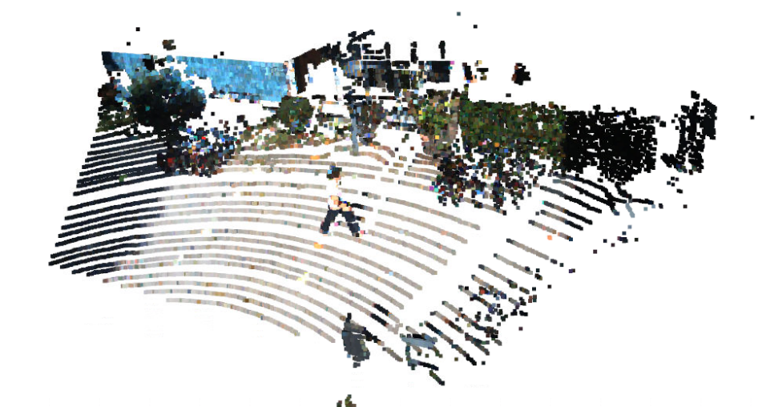
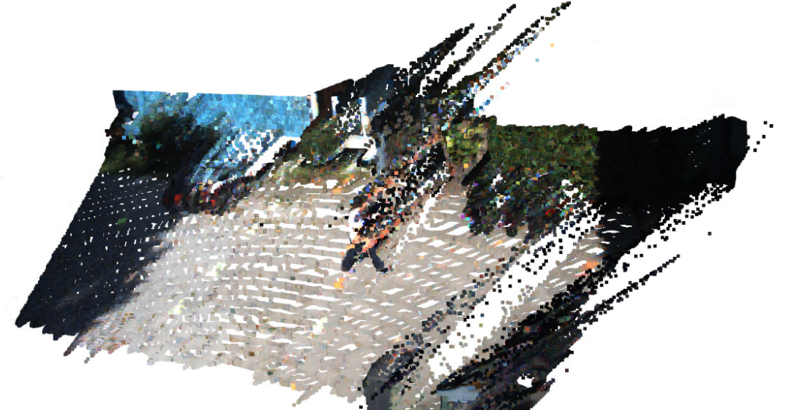

<!-- CSS -->
<link rel="stylesheet" style="text/css" href="../styles.css">
<!--     -->

## Depth estimation/ pseudo 3D point cloud limitations
- [Depth gth](#depth-gth)
- [long tail](#long-tail)
- [occlusion](#occlusion)
- [depth errors](#depth-errors)
- [uncertainty and confidence maps](#uncertainty-and-confidence-maps)
- [sensors degraded](#sensors-degraded)
- [smoothless depth](#smoothless-depth)
- [Depth Uncertainty](#depth-uncertainty)

### Depth gth

Hard to obtain

### Long tail

unclear edge depth

| LiDAR 64 beam | Depth map generated bt NLSPN |
| -- | -- |
|  |  |

### occlusion

[Self-Supervised Scene De-occlusion](https://arxiv.org/abs/2004.02788)

### depth errors

how to remove

### uncertainty and confidence maps

[Conf-Net](https://github.com/hekmak/Conf-net)

### sensors degraded

bad weather

### smoothless depth

Continuous Depth, smoothless depth

### Depth Uncertainty
