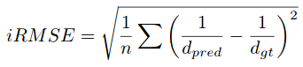
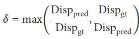
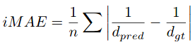
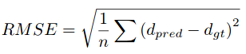
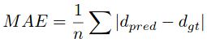

<!-- CSS -->
<link rel="stylesheet" style="text/css" href="../styles.css">
<!--     -->

## Depth Estimation/ Evaluation Metrics 

> **_Depth prediction (DP):_** takes only monocular/ stereo as input 
> **_Depth completion (DC):_** takes depth sensor (ex: LiDAR, RADAR) as input component (converting a sparse depth map Dsparse into a dense depth map Ddense)

> **_Metrics DP:_** Accu, SILog, sqErrorRel, absErrorRel, iRMSE, thresh δ  
> **_Metrics DC:_** Accu, iRMSE, iMAE, RMSE, MAE, thresh δ

https://papers.nips.cc/paper/2014/file/7bccfde7714a1ebadf06c5f4cea752c1-Paper.pdf 

https://arxiv.org/pdf/2003.06620.pdf

## Depth prediction

| Metric | Description | Unit |
| :-- | -- | :--: |
| Accuracies | | |
| SILog | Scale invariant logarithmic error | log(m)*100 |
| sqErrorRel | Relative squared error | % |
| absErrorRel | Relative absolute error | % |
| iRMSE | Root mean squared error of the inverse depth   | 1/km |
| ● thresh δ <1.25   ● thresh δ <1.25^2   ● thresh δ <1.25^3 | δ<threshold error provide a comprehensive comparison among the method   δ<threshold error means the percent of pixels that satisfy δ<threshold, where δ      (Disp)gt: the gth disparity; (Disp)pred: the predicted disparity |

## Depth completion

| Metric (DC) | Description | Unit |
| :-- | -- | :--: |
| Accuracies | | |
| iRMSE |  Root mean squared error of the inverse depth   | 1/km |
| iMAE | Mean absolute error of the inverse depth   | 1/km |
| RMSE | Root mean squared error   | mm |
| MAE | Mean absolute error   | mm |
| ● thresh δ <1.25   ● thresh δ <1.25^2   ● thresh δ <1.25^3 |  |

