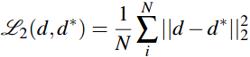

<!-- CSS -->
<link rel="stylesheet" style="text/css" href="../styles.css">
<!--     -->

| Loss | Ref | Des | Formula |
| -- | -- | -- | -- |
| L2 Loss | Eigen et al [[NIPS14]](https://arxiv.org/pdf/1406.2283.pdf) | supervised depth regression |    ● the predicted (d*) and real (d) depth maps  |
| Triplet loss | | | [tensorflow-triplet-loss](https://github.com/omoindrot/tensorflow-triplet-loss) |
| consistency loss | | | |

  
depth estimation (to check)

https://medium.com/swlh/making-a-pseudo-lidar-with-cameras-and-deep-learning-e8f03f939c5f
 
The loss function in the paper and the one used here consists of 3 parts: 
- <b>MAE </b>: This is use to penalize the predicted depth values. This is a pixel wise loss that is independent of other neighboring pixels. Convolutional neural networks work well because they take into account the neighboring pixels and images are highly correlated. Our neural network in this case has an ‘image-like’ output, therefore it makes sense to take into account an image-wise loss rather than using a ‘pixel-wise’ loss alone. A good candidate is, SSIM. 
- <b>SSIM (Structural Similarity Index) </b>: This loss actually measures the perceptual difference between two similar images. Structural information is the idea that the pixels have strong inter-dependencies especially when they are spatially close. These dependencies carry important information about the structure of the objects in the visual scene.
SSIM is widely used as a loss in deep learning for <b>image-reconstruction </b> tasks. SSIM is a structural loss, so it is important to use another loss like MSE/MAE along with it so now we can both penalize the structure as well as pixel wise depths. 
I have earlier worked on image compression on deep learning, and using standalone SSIM as loss resulted in great output, but the colors were off. SSIM won’t know if the image was losing contrast or color. The image shown below is from another project, it isn’t really the best example to show color loss, but I can tell that output was way more structurally similar than MAE, but the problem was color info loss. So using a weighted combination of MSE and SSIM solved this problem. 
- <b>Image gradient loss </b>: An image gradient is a directional change in the intensity or color in an image. The gradient of the image is one of the fundamental building blocks in image processing. For example, the Canny edge detector uses image gradient for edge detection. This loss penalizes the edges in depth output.

